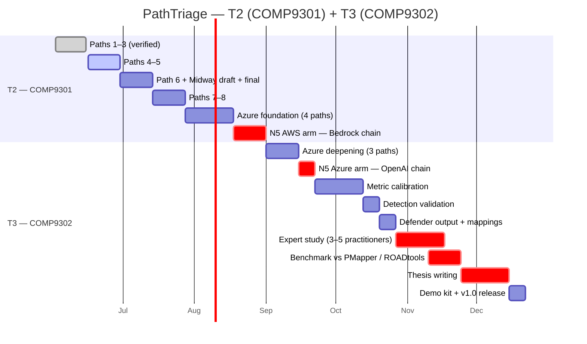

# PathTriage — Project Arc (T2 + T3)

A single-page view of the full COMP9301 + COMP9302 plan, so the scope and the contribution structure are visible at the same time.

---

## Where I am right now

| | Count | Status |
|---|---|---|
| AWS attack paths verified | 3 / 8 | ✅ Paths 1, 2, 3 |
| Azure attack paths verified | 0 / 4 (T2) + 0 / 3 (T3) | 🕒 starts later in T2 |
| Python tool (PathTriage) | v0.0 → v0.1 → v1.0 | ✅ enumerator + graph builder; reachability edges next |
| Decision log entries | 6 | ✅ live audit trail |

---

## Timeline

🟥 Critical-path items (`crit`) are the ones that load the schedule most.

---

## Novelty axes — where the contribution lives

| | Contribution | Status by end of T2 | Status by end of T3 |
|---|---|---|---|
| **N1** | Exploitability scoring rubric (defended) | Rubric drafted, applied to AWS paths | Calibrated + sensitivity sweep |
| **N2** | Cross-path defender output (convergence-based) | AWS detections + SCPs | + Azure Sentinel KQL + Conditional Access |
| **N3** | Validated catalogue (per-path verification convention) | 8 AWS + 4 Azure foundation | + 3 Azure deepening |
| **N4** | Comparative AWS / Azure topology study | Conceptual notes | Full chapter |
| **N5** ⭐ | **AI agent as IAM-graph entry node (ATLAS ↔ ATT&CK Cloud bridge)** | AWS Bedrock chain end-to-end | + Azure OpenAI Assistant chain |

**N5 is the differentiator.** Without it, PathTriage is competing with BloodHound OpenGraph, PMapper, and ROADtools on overlapping ground. With it, no existing tool covers the same surface.

---

## T3 scope concern (Q4 talking point)

T3 has, in 15 weeks, these critical-path items stacked:

- N5 Azure arm
- Expert study
- Benchmark vs two baseline tools
- 50–60 page thesis

Add the non-critical items (Azure paths, calibration, detection validation, defender output, demo kit) and it adds up.

**My instinct on the trim options, if pressed:**

| Item | Keep / trim | Reasoning |
|---|---|---|
| N5 chains (AWS + Azure) | **Keep** | This is the novelty story — drop it and PathTriage loses its differentiator |
| Benchmark | **Keep** | The quantitative contribution — measurable claim |
| Expert study | **Shrink** | 3 practitioners as a case study instead of full inter-rater reliability — still a reportable qualitative finding |
| Demo kit polish | **Trim** | One video + one slide deck, not a full polished kit |
| Comparative topology chapter | **Keep but lean** | Real contribution but doesn't need to be heavy |

This is what I want Lachlan's read on.

---

## Deliverables checklist (T2 → T3)

**T2 — COMP9301 (deliverables D1 – D4):**
- D1: AWS attack-path catalogue (8 paths) + N5 AWS arm
- D2: PathTriage v0.1 prototype (CLI + AWS enumerator + multi-cloud graph schema)
- D3: Decision log + Midway report
- D4: Reproducibility — Terraform labs, verification logs, cost discipline

**T3 — COMP9302 (deliverables D5 – D15):**
- D5: Azure deepening + N5 Azure arm
- D6: PathTriage v1.0
- D7: Comparative topology study
- D8a / D8b: ATT&CK + ATLAS mapping tables
- D9: Benchmark evaluation results
- D10: 50–60 page thesis
- D11: Public release v1.0
- D12: Detection effectiveness validation
- D13: Expert validation study
- D14: `pathtriage-bench` dataset on Zenodo (DOI)
- D15: Demo kit (videos + slide deck)

---

*See `PathTriage-Proposal-v2.md` for the full proposal and `docs/decision_log.md` for the running audit trail.*
